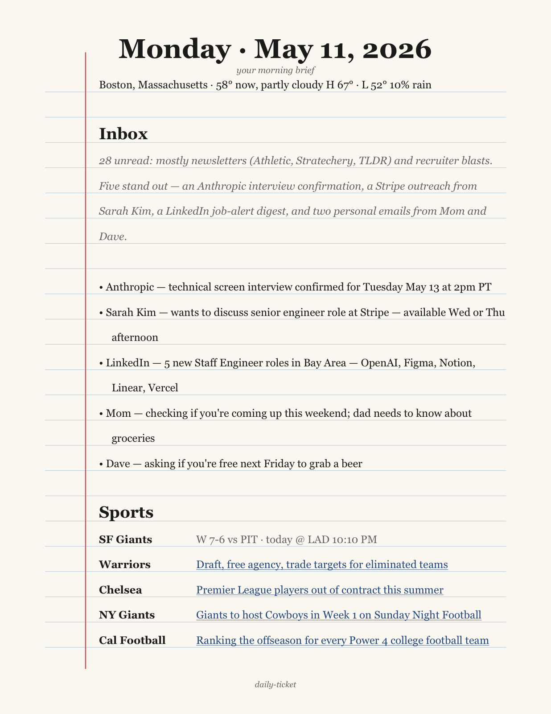

# daily-ticket

A morning desktop "ticket" — a wide-ruled-journal-style HTML page deployed to Vercel every day at 8:00 AM by `launchd`. It pulls weather (geolocated by IP), the most important Gmail of the last 24 hours (ranked by Claude), and yesterday's results / today's schedule for five sports teams, then renders it all as a single self-contained HTML page that looks like a page out of a notebook (cream stock, ruled lines). Sports headlines are clickable. After each run the deployed URL auto-opens in the default browser.

## Sample



Rendered from mock data so the screenshot stays clean of real inbox content. The live page has the same structure, with sports headlines that are actually clickable in the browser.

## Why

A personal experiment in replacing a fragmented morning routine (weather app, inbox triage, sports scores across four sites) with one glanceable artifact that pops open every morning. If it's stale or doesn't open, that itself is the signal that something broke.

## Stack

| Concern | Choice |
|---|---|
| Language | Python 3.11+ |
| Rendering | Plain HTML/CSS, single self-contained file (Georgia + inline CSS, no JS) |
| Hosting | Vercel (`vercel deploy --prod` after each run; SSO-protected) |
| Gmail | Google Gmail API (Python client) — `gmail.readonly` only |
| Email ranking | Anthropic Claude Haiku 4.5 with prompt caching |
| Weather | Open-Meteo (no API key) |
| Geolocation | ip-api.com (no API key) |
| Sports | ESPN public scoreboard + news endpoints |
| Scheduler | macOS `launchd` (survives sleep/wake; cron does not) |

## Architecture

```
            ┌────────────┐
            │  launchd   │  fires daily at 08:00
            └─────┬──────┘
                  ▼
            ┌────────────┐
            │  main.py   │  orchestrates, tolerates partial failure
            └─────┬──────┘
                  │
   ┌──────────┬───┴────┬──────────┬──────────┐
   ▼          ▼        ▼          ▼          ▼
  geo     weather   sports     gmail    email_ranker
                                          (Claude)
                  │
                  ▼
            ┌──────────────┐
            │ render_html  │  → site/index.html
            └─────┬────────┘
                  ▼
            ┌──────────────┐
            │ vercel deploy│  --prod (SSO-protected)
            └─────┬────────┘
                  ▼
           open <deployed URL>
```

Each fetcher is a standalone module under `fetchers/`, runnable from the CLI for smoke testing. Network failures degrade gracefully — a missing section renders a placeholder rather than crashing the whole run.

## Project layout

```
daily-ticket/
├── fetchers/
│   ├── geo.py            # ip-api.com
│   ├── weather.py        # Open-Meteo
│   ├── sports.py         # ESPN scoreboard + news
│   ├── gmail.py          # Gmail metadata pull
│   └── email_ranker.py   # Claude Haiku 4.5 ranker
├── ranker_rubric.md      # Editable rubric for the email ranker
├── render_html.py        # HTML renderer — writes site/index.html
├── site/                 # Vercel project root (deployed dir)
├── main.py               # orchestrator — loaded by launchd
├── net.boonin.daily-ticket.plist  # launchd config (8:00 AM daily)
├── setup_gmail.py        # one-time OAuth bootstrap
├── requirements.txt
├── PLAN.md               # phased implementation plan
└── README.md
```

Secrets (`.env`, `credentials.json`, `token.json`) and generated files (`.venv/`, `logs/`) are gitignored.

## Setup

```bash
python3 -m venv .venv
.venv/bin/pip install -r requirements.txt

# Place a Google Cloud OAuth client JSON at credentials.json (Desktop app type,
# gmail.readonly scope). Then bootstrap the token:
.venv/bin/python setup_gmail.py
```

Add `ANTHROPIC_API_KEY=...` to `.env` for the Phase 3 ranker.

### One-time Vercel setup

```bash
# 1. Install the CLI globally (already done on this machine):
#    sudo npm i -g vercel
# 2. Log in once (browser flow):
vercel login
# 3. Link the site/ directory to a new Vercel project:
cd site && vercel link --yes && cd ..
# 4. Enable Deployment Protection → Vercel Authentication (SSO) in the
#    project's dashboard so only your Vercel account can view the page.
# 5. Create a personal token at https://vercel.com/account/tokens and add
#    VERCEL_TOKEN=... to .env. main.py reads this to deploy non-interactively.
```

## Smoke-test each fetcher

```bash
.venv/bin/python -m fetchers.geo
.venv/bin/python -m fetchers.weather
.venv/bin/python -m fetchers.sports
.venv/bin/python -m fetchers.gmail
```

## Run the full pipeline manually

```bash
.venv/bin/python main.py
```

Writes `site/index.html`, runs `vercel deploy --prod`, opens the deployed
URL in your browser, and appends a structured run summary to `logs/run.log`.
If `VERCEL_TOKEN` is unset or `site/.vercel/project.json` is missing, the
deploy step is skipped (HTML is still written locally).

## Schedule with launchd

```bash
cp net.boonin.daily-ticket.plist ~/Library/LaunchAgents/
launchctl load -w ~/Library/LaunchAgents/net.boonin.daily-ticket.plist
launchctl list | grep daily-ticket          # confirm loaded
launchctl start net.boonin.daily-ticket     # force-fire to test
```

The job runs at 8:00 AM local time. macOS `launchd` catches up on the next
wake if the Mac was asleep at 8 AM. Stdout / stderr land in
`~/Library/Logs/daily-ticket/stdout.log` and `stderr.log` (kept off `~/Desktop`
so launchd's xpcproxy isn't blocked by macOS TCC on the Desktop folder).
The app's own structured log stays at `logs/run.log` inside the repo.
To disable: `launchctl unload -w ~/Library/LaunchAgents/net.boonin.daily-ticket.plist`.

## Status

| Phase | Description | State |
|---|---|---|
| 0 | API surface documentation | done |
| 1 | Scaffolding + Gmail OAuth | done |
| 1.5 | Git + GitHub remote | done |
| 2 | Data fetchers | done |
| 3 | Claude email ranker | done |
| 4 | PDF rendering | done |
| 5 | Orchestration + launchd | done |
| 6 | End-to-end verification | done |

See [`PLAN.md`](PLAN.md) for the full phased plan, including the verified API surface for each external service.

## Design notes

- **Gmail scope is read-only.** No modify, no send. The OAuth client is a Desktop app with the user as the only test user.
- **Prompt caching** on the email-ranker's system prompt — the rubric is identical every morning, so cache hits drop the per-run cost to roughly $0.001.
- **No retries.** If a fetcher fails, the section is omitted and execution continues. The next morning's run is the retry.
- **Paywall avoidance.** Sports headline links use ESPN's free `www.espn.com` URLs; the fetcher skips articles flagged `premium` or hosted on `espnplus.com`.
- **Repo is private.** Rendered PDFs contain email senders and subjects.
